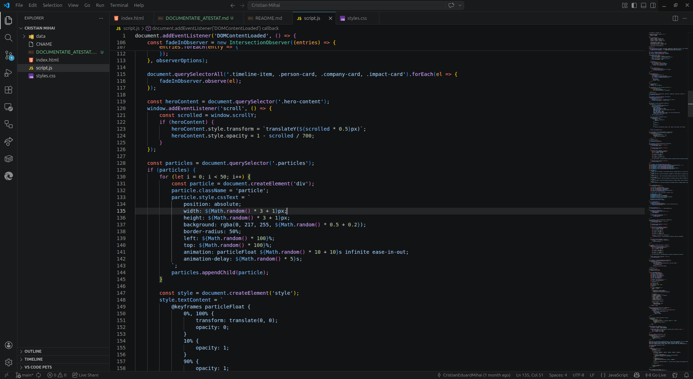
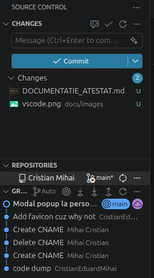
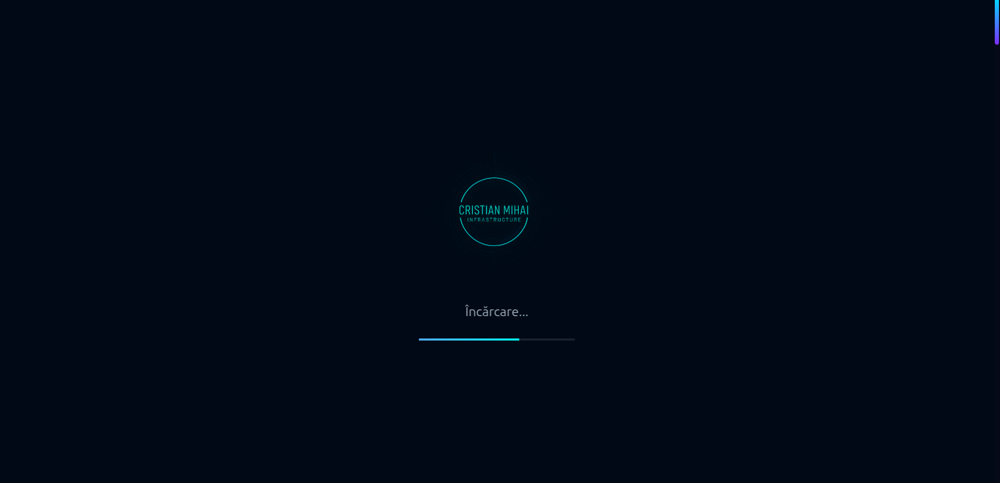
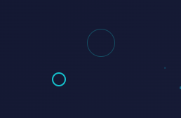
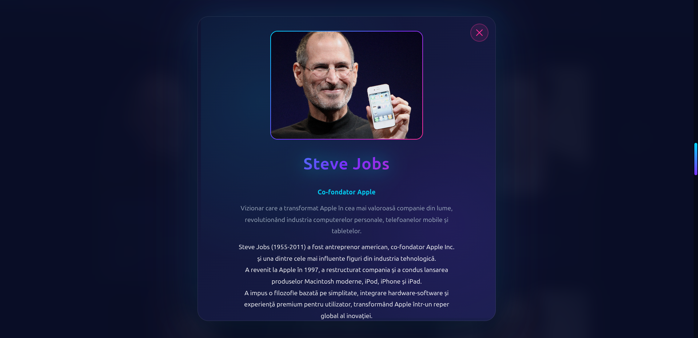
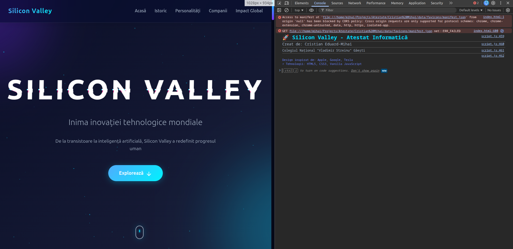

# ATESTAT LA INFORMATICA
## Silicon Valley - Epicentrul Inovatiei Tehnologice

**Elev:** Cristian Eduard-Mihai  
**Clasa:** a XII-a C, Matematica-Informatica  
**Profesor coordonator:** Andreescu Lucia-Daniela  
**Unitatea de invatamant:** Colegiul National "Vladimir Streinu" Gaesti  
**An scolar:** 2025-2026

**Repository GitHub:** https://github.com/CristianEduardMihai/atestat-2026  
**Website live:** https://atestat.cristianmihai.cc/  
**Nota de performanta:** Pentru fluiditate maxima (animatii, efecte 3D, modaluri si tranzitii), este recomandat un calculator modern (CPU/GPU generatie recenta, minimum 8GB RAM, browser actualizat).

---

## Cuprins
1. Argument si relevanta temei
2. Obiectivele proiectului
3. Analiza tehnica a solutiei
4. Arhitectura aplicatiei
5. Implementare front-end (HTML, CSS, JavaScript)
6. Functionalitati interactive avansate
7. Design, UX/UI si responsive
8. Optimizare, compatibilitate si bune practici
9. Testare si validare
10. Ghid de utilizare si intretinere
11. Concluzii
12. Bibliografie
13. Anexa A - Structura proiectului
14. Anexa B - Fragmente de cod reprezentative

---

## 1. Argument si relevanta temei

Tema aleasa, **Silicon Valley - Epicentrul Inovatiei Tehnologice**, are o importanta majora deoarece prezinta zona geografica si ecosistemul care au modelat evolutia tehnologiei moderne: calculatoare personale, internet, smartphone-uri, inteligenta artificiala, cloud computing, vehicule electrice si multe altele.

Relevanta temei este si una personala: am inteles mai bine impactul real al acestui ecosistem in momentul in care am fost chemat la sediul Microsoft, experienta care mi-a confirmat ca Silicon Valley nu este doar un subiect teoretic, ci centrul unde se definesc directiile tehnologice globale.

Acest proiect de atestat a fost gandit ca o aplicatie web moderna de tip "single-page", cu accent pe:
- prezentare vizuala premium;
- interactiune avansata cu utilizatorul;
- organizare clara a informatiei;
- implementare fara framework-uri externe, doar cu tehnologii web standard.

Aplicatia nu este un simplu site static de prezentare, ci o lucrare complexa cu animatii, efecte de paralaxa, observatori de intersectie, modale dinamice, efecte 3D la miscare, numere animate si elemente de branding personal.

---

## 2. Obiectivele proiectului

### 2.1 Obiectiv general
Realizarea unei aplicatii web educationale si interactive, care sa explice impactul Silicon Valley asupra societatii si economiei globale, folosind tehnologii web moderne la nivel de liceu avansat.

### 2.2 Obiective specifice
- Organizarea continutului in sectiuni tematice: istoric, personalitati, companii, impact global.
- Implementarea unui design modern, coerent, cu identitate vizuala proprie.
- Adaugarea de interactiuni avansate pentru o experienta de utilizare superioara.
- Integrarea elementelor multimedia locale (imagini, SVG-uri, favicon-uri complete).
- Realizarea unei pagini responsive, adaptabile pe desktop, tableta si telefon.

---

## 3. Analiza tehnica a solutiei

Aplicatia este dezvoltata pe arhitectura **front-end pura**, fara backend si fara baza de date, avand urmatoarele avantaje:
- rulare locala imediata in browser;
- portabilitate ridicata;
- cost de mentenanta redus;
- transparenta a codului sursa pentru evaluare educationala.

### 3.1 Tehnologii utilizate
- **HTML5** - structura semantica a continutului si organizarea pe sectiuni tematice;
- **CSS3** - implementare vizuala avansata: variabile, gradienturi, keyframes, layout responsive, micro-interactiuni;
- **JavaScript (Vanilla ES6+)** - logica aplicatiei: event listeners, IntersectionObserver, modaluri dinamice, animatii dependente de scroll.

### 3.2 Programe si instrumente folosite
- **Visual Studio Code** - principalul mediu de lucru, utilizat pentru editare cod, structurare fisiere si management rapid al modificarilor;


- **Browser modern (Chrome/Chromium/Firefox)** - testare functionala, verificare responsive si observarea performantelor in timp real;
- **Git + GitHub** - versionare si publicarea proiectului in repository-ul oficial: https://github.com/CristianEduardMihai/atestat-2026;


- **Hosting static - GitHub Pages** - publicarea versiunii finale la adresa: https://atestat.cristianmihai.cc/.

In practica, Visual Studio Code a fost instrumentul central folosit pe tot parcursul dezvoltarii, iar restul instrumentelor au avut rol de testare, validare si publicare.

### 3.3 Modul de abordare al site-ului
Abordarea proiectului a fost etapizata, pentru a obtine un rezultat stabil si usor de extins:

1. **Planificare continut**
    - definirea capitolelor principale (istoric, personalitati, companii, impact global);
    - stabilirea ierarhiei informatiei si a mesajului educational.

2. **Implementare structurala (HTML)**
    - construirea unei pagini single-page, cu sectiuni clare si navigare interna;
    - pregatirea containerelor pentru carduri, timeline, statistici si modaluri.

3. **Implementare vizuala (CSS)**
    - definirea temei cromatice si a identitatii vizuale;
    - realizarea layout-urilor responsive si a animatiilor.

4. **Interactivitate (JavaScript)**
    - adaugarea efectelor de scroll, hover, numere animate, modaluri si redirect-uri;
    - integrarea evenimentelor de control pentru o experienta fluida.

5. **Testare si rafinare**
    - verificare comportament pe rezolutii diferite;
    - ajustari de performanta pentru a mentine fluiditatea animatiilor;
    - publicare pe hosting live pentru validare in conditii reale.

Aceasta metoda de lucru a permis dezvoltarea treptata a unui proiect mai complex decat un site static clasic, fara a compromite claritatea codului.

---

## 4. Arhitectura aplicatiei

Aplicatia este organizata pe 3 fisiere principale si un folder de resurse:
- `index.html` - structura completa a paginii si continutul educational;
- `styles.css` - stilizarea avansata a tuturor componentelor;
- `script.js` - logica dinamica (scroll, animatii, modal, evenimente);
- `data/` - imagini ale personalitatilor, logo-uri SVG, favicon-uri, fotografie Google Headquarters.

Modelul de functionare este:
1. Browserul incarca structura HTML.
2. CSS aplica stiluri, layout-uri si animatii.
3. JavaScript ataseaza event listeners si controleaza efectele dinamice.

---

## 5. Implementare front-end (HTML, CSS, JavaScript)

## 5.1 Structura HTML

Pagina este impartita in sectiuni majore:
- Hero section cu titlu animat;
- Sectiune "Evolutia Silicon Valley" (cronologie);
- Sectiune "Vizionarii Silicon Valley" (person-card-uri);
- Sectiune "Gigantii Tehnologici" (company-card-uri);
- Sectiune "Impactul Global" (impact-card-uri);
- Concluzie;
- Footer cu datele proiectului.

Sunt incluse si doua modale:
- modal personalitati (dinamic, se completeaza la click pe card);
- modal Google HQ (easter egg pe cardul Google).

## 5.2 Stilizare CSS

Fisierul CSS depaseste 1500 de linii si contine:
- variabile CSS globale (`:root`) pentru tema cromatica;
- gradienturi multiple si umbre complexe;
- animatii keyframes pentru loader, glitch, pulse, glow, modal etc.;
- layout Grid/Flexbox pentru continut complex;
- media queries pentru dispozitive mobile.

## 5.3 Logica JavaScript

Scriptul implementeaza:
- loader initial cu fade-out controlat temporal;
- bara de progres la scroll;
- cursor custom + cursor follower;
- evidentierea automata a link-ului de navigare activ;
- scroll smooth intre sectiuni;
- animatii declansate la aparitie in viewport cu `IntersectionObserver`;
- efecte 3D pentru cardurile de personalitati si companii;
- modale interactive (open/close/ESC/overlay);
- deschidere site-uri oficiale pentru cardurile companiilor;
- animarea numerelor statistice in sectiunea impact.

---

## 6. Functionalitati interactive avansate

### 6.1 Loader custom
La incarcarea paginii apare un ecran de loading cu logo personalizat, text si bara de progres animata, urmat de tranzitie de disparitie.



### 6.2 Cursor personalizat
Aplicatia inlocuieste cursorul standard cu doua elemente animate (`.cursor`, `.cursor-follower`) ce reactioneaza fluid la miscare.



### 6.3 Efecte de hover 3D pe carduri
Cardurile de personalitati si companii reactioneaza la pozitia mouse-ului prin transformari de tip rotate/translate pentru senzatia de profunzime.

### 6.4 Modale avansate
- **Modal personalitati:** la click pe fiecare person-card, se afiseaza imaginea si rezumat extins (tip Wikipedia).
- **Modal Google HQ:** la click pe cardul Google, se afiseaza un popup cu o fotografie personala din Mountain View, California.

Ambele modale suporta:
- inchidere pe buton;
- inchidere la click pe overlay;
- inchidere cu tasta ESC.



### 6.5 Carduri companie cu redirect extern
Cardurile Apple, Meta, Tesla, NVIDIA si Intel deschid in tab nou site-ul oficial al companiei.

### 6.6 Statistici animate
Valorile numerice din sectiunea "Impactul Global" sunt animate progresiv la intrarea in viewport, pentru efect vizual dinamic.

### 6.7 Easter eggs
- Triplu-click pe logo activeaza schimbarea rapida de culoare in tema paginii.
- Mesaje tematice in consola pentru componenta de branding personal.
- Modal ascuns cu o fotografie personala la click pe cardul Google.



---

## 7. Design, UX/UI si responsive

### 7.1 Directie vizuala
Design-ul urmareste o estetica futurista, inspirata de ecosistemul tech:
- paleta neon (cyan, violet, magenta) pe fundal inchis;
- contraste mari pentru lizibilitate;
- glow effects pentru elementele importante;
- compozitie aerisita cu accent pe ierarhia informatiei.

### 7.2 Experienta utilizatorului
- Navigare fixa in partea superioara (navbar sticky/fixed).
- Sectiuni clar delimitate si usor de parcurs.
- Feedback vizual la hover/click.
- Tranzitii line pentru reducerea senzatiei de "ruptura" intre ecrane.

### 7.3 Responsive design
Aplicatia include breakpoints pentru ecrane mici, unde:
- grilele trec pe mai putine coloane;
- tipografia este redimensionata;
- elementele modale sunt compactate;
- imaginile din modalul personalitatilor sunt scalate pentru a permite afisarea textului la zoom 100%.

---

## 8. Optimizare, compatibilitate si bune practici

### 8.1 Optimizari aplicate
- Utilizarea imaginilor locale (fara dependente externe runtime).
- Transformari CSS hardware-accelerated (`transform`, `opacity`).
- Selectori si structura modulara pentru mentenanta usoara.
- Favicon set complet (Apple/Android/Desktop/PWA meta).

### 8.2 Compatibilitate
Aplicatia functioneaza in browsere moderne care suporta:
- CSS custom properties;
- `IntersectionObserver`;
- transformari 2D/3D;
- evenimente moderne JavaScript.

### 8.3 Accesibilitate (aspecte implementate)
- imagini cu atribute `alt`;
- structura semantica pe sectiuni;
- butoane de inchidere modal cu `aria-label`;
- contrast ridicat text/fundal.

---

## 9. Testare si validare

Testarea s-a realizat manual, pe scenarii functionale:

1. **Incarcare initiala:** verificare loader, disparitie corecta, afisare continut.
2. **Navigare:** fiecare link din meniu duce in sectiunea corecta.
3. **Interactiuni carduri personalitati:** deschidere modal, afisare date corecte, inchidere in toate modurile.
4. **Interactiuni carduri companii:** redirect corect catre site-urile oficiale.
5. **Modal Google HQ:** afisare popup si inchidere corecta.
6. **Statistici impact:** animatii numerice active doar la intrarea in viewport.
7. **Responsive:** verificare layout pe rezolutii mici si medii.
8. **Favicon-uri:** verificare afisare iconite in tab/browser.

Rezultat: functionalitatile implementate functioneaza conform cerintelor proiectului.

---

## 10. Ghid de utilizare si intretinere

### 10.1 Rulare locala
1. Se deschide folderul proiectului in Visual Studio Code.
2. Se ruleaza fisierul `index.html` in browser.
3. Nu sunt necesare dependente suplimentare.

### 10.2 Actualizarea continutului
- Textul se editeaza in `index.html`.
- Stilurile se editeaza in `styles.css`.
- Comportamentul dinamic se editeaza in `script.js`.
- Imaginile se inlocuiesc in folderul `data/` pastrand numele fisierelor (sau actualizand calea in cod).

### 10.3 Recomandari de mentenanta
- Pastrarea structurii pe componente (sectiuni/carduri/modale).
- Evitarea duplicarii de cod JavaScript.
- Testare dupa fiecare modificare majora de stil sau script.

---

## 11. Concluzii

Proiectul "Silicon Valley - Epicentrul Inovatiei Tehnologice" este o lucrare de atestat complexa, care depaseste nivelul unui site de prezentare simplu prin:
- numar ridicat de componente UI;
- animatii avansate si efecte vizuale moderne;
- interactiuni multiple cu utilizatorul;
- integrarea de modale dinamice si functionalitati contextuale;
- organizare structurata a continutului educational.

Prin realizarea acestui proiect, au fost consolidate competente importante de front-end:
- structurare semantica HTML5;
- design responsive avansat in CSS3;
- programare JavaScript orientata pe evenimente si interactivitate.

Aplicatia poate constitui o baza solida pentru dezvoltari viitoare (de exemplu migrare spre framework modern, integrare backend sau adaugare de functionalitati de tip dashboard).

---

## 12. Bibliografie

1. MDN Web Docs - HTML:
   - https://developer.mozilla.org/en-US/docs/Web/HTML
2. MDN Web Docs - CSS:
   - https://developer.mozilla.org/en-US/docs/Web/CSS
3. MDN Web Docs - JavaScript:
   - https://developer.mozilla.org/en-US/docs/Web/JavaScript
4. W3C Web Standards:
   - https://www.w3.org/standards/
5. Documentare oficiala companii tech (pentru date contextuale):
   - https://www.apple.com/
   - https://about.google/
   - https://about.meta.com/
   - https://www.tesla.com/
   - https://www.nvidia.com/
   - https://www.intel.com/

---

## 13. Anexa A - Structura proiectului

```text
Cristian Mihai/
├── CNAME
├── index.html
├── styles.css
├── script.js
└── data/
    ├── CM_infrastructure_logo.png
    ├── google-hq.jpg
    ├── steve-jobs.png
    ├── bill-gates.png
    ├── elon-musk.png
    ├── mark-zuckerberg.png
    ├── larry-page.png
    ├── sergey-brin.png
    ├── svgs/
    │   ├── apple.svg
    │   ├── google.svg
    │   ├── meta.svg
    │   ├── tesla.svg
    │   ├── nvidia.svg
    │   └── intel.svg
    └── favicons/
        ├── favicon.ico
        ├── favicon-16x16.png
        ├── favicon-32x32.png
        ├── favicon-96x96.png
        ├── android-icon-192x192.png
        ├── manifest.json
        └── ...
```


## 14. Anexa B - Fragmente de cod reprezentative

### B.1 Definire tema vizuala cu variabile CSS
```css
:root {
    --primary: #00D9FF;
    --secondary: #7B2FFF;
    --accent: #FF2E97;
    --bg-dark: #0A0E27;
    --bg-darker: #060918;
}
```

### B.2 Activare modal personalitate la click pe card
```javascript
const personCards = document.querySelectorAll('.person-card');
personCards.forEach(card => {
    card.addEventListener('click', () => openPersonModal(card));
});
```

### B.3 Redirect extern pentru carduri companie
```javascript
const companyLinks = {
    'apple-card': 'https://www.apple.com',
    'meta-card': 'https://www.meta.com',
    'tesla-card': 'https://www.tesla.com',
    'nvidia-card': 'https://www.nvidia.com',
    'intel-card': 'https://www.intel.com'
};
```

### B.4 Animare numerica pentru statistici
```javascript
const duration = 2000;
const steps = 60;
const increment = number / steps;
```

### B.5 Inchidere modal la tasta ESC
```javascript
document.addEventListener('keydown', (e) => {
    if (e.key === 'Escape' && modal.classList.contains('active')) {
        modal.classList.remove('active');
    }
});
```

---

## Declaratie finala

Prezenta documentatie descrie fidel proiectul realizat pentru examenul de atestat la informatica. Continutul tehnic, structura si explicatiile sunt adaptate aplicatiei web dezvoltate in cadrul lucrarii, avand ca tema Silicon Valley.
